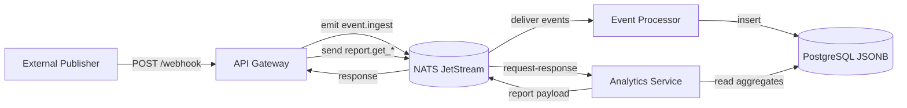

# Event Pipeline Microservices


High-throughput event ingestion platform for marketing data (Facebook/TikTok), built as decoupled NestJS microservices with NATS and PostgreSQL.

## Architecture



## Why Strict Microservices

We intentionally moved away from a previous hybrid architecture because it created severe runtime contention: heavy JSONB aggregation queries were blocking the Node.js event loop and simultaneously starving ingestion workers of database connection pool resources. Splitting the system into three dedicated apps gives us clear **Resource Isolation** (write path vs read path), **Independent Scaling** (for example, scale analytics replicas without scaling webhook ingestion), and strong **Separation of Concerns** (HTTP ingress/facade, async write processing, and reporting are independently deployable and operable).

## Tech Stack

- **NestJS + Bun**: ergonomic TypeScript architecture with fast startup/runtime and efficient local/container workflows.
- **NATS JetStream**: durable, at-least-once event delivery between services with decoupled producers/consumers.
- **PostgreSQL + JSONB**: relational durability plus flexible schema for heterogeneous Facebook/TikTok payloads.

## Quick Start

```bash
docker-compose up --build
```

API Gateway is available on `http://localhost:3000`.
Swagger UI is available on `http://localhost:3000/swagger`.

## Project Structure

```text
.
├── api-gateway/
├── event-processor/
├── analytics-service/
└── docker-compose.yml
```
