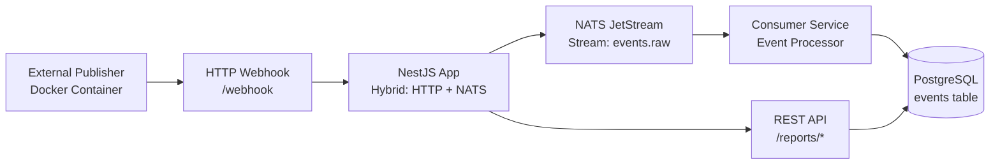

Дякую за зауваження! Ви маєте рацію — мій попередній підхід використовував NATS клієнт напряму, що не відповідає патернам NestJS. Давайте виправимо це, використовуючи офіційну інтеграцію NestJS з NATS (Transporter) та JetStream.

---

# 🎯 Виправлена інструкція: Архітектура з NestJS NATS Transporter

## 1. Основна концепція: NestJS Microservices Transporter
NestJS має вбудовану підтримку NATS через **Microservices Transporter**. Це означає:
- Ваш додаток одночасно може бути **HTTP-сервером** (для вебхуків) і **NATS microservice** (для обробки подій)
- NestJS сам керує підключенням, повторними спробами, серіалізацією
- Використовується патерн **Message Patterns** (для запит-відповідь) та **Event Patterns** (для pub-sub)



## 2. Чому NestJS Transporter кращий за прямий клієнт?
| Підхід | Переваги | Недоліки |
|--------|----------|----------|
| **NestJS Transporter** | Вбудована серіалізація, health checks, dependency injection, масштабування | Більше абстракцій |
| **Прямий nats клієнт** | Більше контролю | Більше boilerplate коду, ручне управління підключеннями |

Згідно з офіційною документацією NestJS, NATS transporter підтримує:
- **Event-based messaging** через Publish-Subscribe 【turn1search3】
- **Queue groups** для load balancing 【turn1search3】
- **At least once** delivery через JetStream 【turn1search2】【turn1search6】

## 3. Архітектурні рішення

### 3.1 Hybrid Application Pattern
Ваш NestJS додаток буде одночасно:
1. **HTTP сервер** — для прийому вебхуків (REST API)
2. **NATS Microservice** — для обробки подій (background worker)

Це досягається через `connectMicroservice()` в `main.ts`.

### 3.2 JetStream для надійності
Оскільки необхідна надійна доставка (at least once), обов'язково використовуємо JetStream:
- Створюємо **Stream** з назвою `events.raw`
- Використовуємо **Consumer** з `ack_policy: explicit`
- Повідомлення підтверджуються тільки після успішного запису в БД

### 3.3 Subject Design
NATS використовує subject-based messaging. Рекомендована структура:
- `events.raw.facebook.*` — для Facebook подій
- `events.raw.tiktok.*` — для TikTok подій
- `events.raw.>` — для всіх подій (wildcard)

---

# 📁 Виправлена структура проєкту

```text
events-processor/
├── src/
│   ├── main.ts                          # Bootstrap з Hybrid setup
│   ├── app.module.ts                    # Кореневий модуль
│   │
│   ├── common/
│   │   └── health.controller.ts         # HTTP health check
│   │
│   ├── events/
│   │   ├── dto/
│   │   │   └── event.dto.ts             # Типи з завдання
│   │   ├── entities/
│   │   │   └── event.entity.ts          # TypeORM схема
│   │   ├── events.module.ts            # Модуль подій
│   │   ├── webhook.controller.ts       # HTTP endpoint для паблішера
│   │   ├── event.processor.ts          # NATS subscriber (worker)
│   │   └── event.service.ts            # Бізнес-логіка
│   │
│   ├── reports/
│   │   ├── reports.controller.ts       # REST API для аналітики
│   │   ├── reports.service.ts          # SQL запити
│   │   └── reports.module.ts
│   │
│   └── nats/
│       ├── nats.module.ts              # Конфігурація NATS transporter
│       └── nats.config.ts              # Опції підключення
│
├── docker-compose.yml
├── Dockerfile
├── package.json
└── tsconfig.json
```
IMPORTANT ALL modules/controller etc create via cli `bunx nest generate`
for migrations use typeorm cli `bunx typeorm`

---

# 💻 Виправлений код реалізації

## 1. `main.ts` — Hybrid Bootstrap
```typescript
import { NestFactory } from '@nestjs/core';
import { AppModule } from './app.module';
import { MicroserviceOptions, Transport } from '@nestjs/microservices';

async function bootstrap() {
  const app = await NestFactory.create(AppModule);
  
  // HTTP server
  app.enableCors();
  await app.listen(3000);
  
  // NATS Microservice (для обробки подій)
  app.connectMicroservice<MicroserviceOptions>({
    transport: Transport.NATS,
    options: {
      servers: [process.env.NATS_URL || 'nats://localhost:4222'],
      queue: 'event-processors', // Queue group для load balancing
      gracefulShutdown: true,    // Коректне завершення
    },
  });
  
  await app.startAllMicroservices();
  console.log('🚀 Application is running on http://localhost:3000');
  console.log('📡 Connected to NATS');
}
bootstrap();
```

## 2. `src/nats/nats.module.ts` — Конфігурація NATS
```typescript
import { Module } from '@nestjs/common';
import { ClientsModule, Transport } from '@nestjs/microservices';

@Module({
  imports: [
    ClientsModule.register([
      {
        name: 'NATS_PUBLISHER',
        transport: Transport.NATS,
        options: {
          servers: [process.env.NATS_URL || 'nats://localhost:4222'],
        },
      },
    ]),
  ],
  exports: [ClientsModule],
})
export class NatsModule {}
```

## 3. `src/events/events.module.ts` — Модуль подій
```typescript
import { Module } from '@nestjs/common';
import { TypeOrmModule } from '@nestjs/typeorm';
import { Event } from './entities/event.entity';
import { WebhookController } from './webhook.controller';
import { EventProcessor } from './event.processor';
import { EventService } from './event.service';
import { NatsModule } from '../nats/nats.module';

@Module({
  imports: [
    TypeOrmModule.forFeature([Event]),
    NatsModule, // Для відправки в NATS
  ],
  controllers: [WebhookController],
  providers: [EventProcessor, EventService],
  exports: [EventService],
})
export class EventsModule {}
```

## 4. `src/events/webhook.controller.ts` — Прийом вебхуків
```typescript
import { Controller, Post, Body } from '@nestjs/common';
import { ClientProxy } from '@nestjs/microservices';
import { Inject } from '@nestjs/common';
import { firstValueFrom } from 'rxjs';
import { Event } from './dto/event.dto';

@Controller('webhook')
export class WebhookController {
  constructor(
    @Inject('NATS_PUBLISHER') private natsClient: ClientProxy,
  ) {}

  @Post()
  async handleWebhook(@Body() event: Event) {
    // Відправляємо в NATS з subject залежно від типу події
    const subject = `events.raw.${event.source}.${event.eventType}`;
    
    // NestJS автоматично серіалізує та десеріалізує
    this.natsClient.emit(subject, event);
    
    return { 
      status: 'accepted',
      subject: subject,
      eventId: event.eventId 
    };
  }
}
```

## 5. `src/events/event.processor.ts` — NATS Subscriber (Worker)
```typescript
import { Controller } from '@nestjs/common';
import { EventPattern, Payload, Ctx } from '@nestjs/microservices';
import { NatsContext } from '@nestjs/microservices';
import { EventService } from './event.service';
import { Event } from './dto/event.dto';

@Controller()
export class EventProcessor {
  constructor(private readonly eventService: EventService) {}

  // Слухає всі події (wildcard pattern)
  @EventPattern('events.raw.>')
  async handleEvent(
    @Payload() event: Event,
    @Ctx() context: NatsContext,
  ) {
    const subject = context.getSubject();
    console.log(`📨 Received event from subject: ${subject}`);
    
    try {
      // Зберігаємо в БД з ідемпотентністю
      await this.eventService.saveEvent(event);
      console.log(`✅ Saved event ${event.eventId}`);
    } catch (error) {
      console.error(`❌ Error processing event ${event.eventId}:`, error);
      // JetStream автоматично повторить доставку
      throw error;
    }
  }
}
```

## 6. `src/events/event.service.ts` — Бізнес-логіка
```typescript
import { Injectable } from '@nestjs/common';
import { InjectRepository } from '@nestjs/typeorm';
import { Repository } from 'typeorm';
import { Event } from './entities/event.entity';
import { Event as EventDTO } from './dto/event.dto';

@Injectable()
export class EventService {
  constructor(
    @InjectRepository(Event) private eventRepository: Repository<Event>,
  ) {}

  async saveEvent(eventData: EventDTO): Promise<void> {
    const event = this.eventRepository.create({
      eventId: eventData.eventId,
      timestamp: new Date(eventData.timestamp),
      source: eventData.source,
      funnelStage: eventData.funnelStage,
      eventType: eventData.eventType,
      data: eventData.data, // JSONB
    });

    // Ідемпотентна вставка: ON CONFLICT DO NOTHING
    await this.eventRepository
      .createQueryBuilder()
      .insert()
      .into(Event)
      .values(event)
      .orIgnore() // Якщо eventId існує — ігноруємо
      .execute();
  }
}
```

## 7. `src/events/entities/event.entity.ts` — TypeORM Entity
```typescript
import { Entity, Column, PrimaryGeneratedColumn, Index } from 'typeorm';

@Entity()
export class Event {
  @PrimaryGeneratedColumn('uuid')
  id: string;

  @Index({ unique: true }) // Унікальний індекс для ідемпотентності
  @Column({ type: 'varchar', unique: true })
  eventId: string;

  @Column({ type: 'timestamp with time zone' })
  timestamp: Date;

  @Column({ type: 'varchar' })
  source: 'facebook' | 'tiktok';

  @Column({ type: 'varchar' })
  funnelStage: 'top' | 'bottom';

  @Column({ type: 'varchar' })
  eventType: string;

  @Column({ type: 'jsonb' }) // Всі додаткові дані
  data: any;
}
```

## 8. `src/app.module.ts` — Кореневий модуль
```typescript
import { Module } from '@nestjs/common';
import { TypeOrmModule } from '@nestjs/typeorm';
import { EventsModule } from './events/events.module';
import { ReportsModule } from './reports/reports.module';
import { Event } from './events/entities/event.entity';

@Module({
  imports: [
    TypeOrmModule.forRoot({
      type: 'postgres',
      host: process.env.DB_HOST || 'localhost',
      port: parseInt(process.env.DB_PORT, 10) || 5432,
      username: process.env.DB_USER || 'user',
      password: process.env.DB_PASSWORD || 'password',
      database: process.env.DB_NAME || 'events_db',
      entities: [Event],
      synchronize: false, // Використовуємо міграції
      logging: true,
    }),
    EventsModule,
    ReportsModule,
  ],
})
export class AppModule {}
```

## 9. `docker-compose.yml` — Виправлена конфігурація
```yaml
version: '3.8'

services:
  postgres:
    image: postgres:15-alpine
    environment:
      POSTGRES_USER: user
      POSTGRES_PASSWORD: password
      POSTGRES_DB: events_db
    ports:
      - "5432:5432"
    healthcheck:
      test: ["CMD-SHELL", "pg_isready -U user -d events_db"]
      interval: 5s
      timeout: 5s
      retries: 5

  nats:
    image: nats:latest
    ports:
      - "4222:4222"
      - "8222:8222" # Monitoring port
    healthcheck:
      test: ["CMD", "wget", "--no-verbose", "--tries=1", "--spider", "http://localhost:8222/healthz"]
      interval: 10s
      timeout: 5s
      retries: 3

  app:
    build: .
    ports:
      - "3000:3000"
    environment:
      - DB_HOST=postgres
      - DB_PORT=5432
      - DB_USER=user
      - DB_PASSWORD=password
      - DB_NAME=events_db
      - NATS_URL=nats://nats:4222
    depends_on:
      postgres:
        condition: service_healthy
      nats:
        condition: service_healthy

  publisher:
    image: andriiuni/events
    environment:
      - EVENT_ENDPOINT=http://app:3000/webhook
    depends_on:
      - app
```

## 10. `Dockerfile` — Оптимізований для NestJS + Bun
```dockerfile
FROM oven/bun:1 AS base
WORKDIR /app

# Install dependencies
FROM base AS install
COPY package.json bun.lockb ./
RUN bun install --frozen-lockfile

# Build
FROM base AS release
COPY --from=install /app/node_modules ./node_modules
COPY . .

# Run migrations and start
CMD ["sh", "-c", "bun run typeorm migration:run -d src/data-source.ts && bun run start:prod"]
```

---

# 🚀 Покрокова інструкція запуску

1. **Створіть проєкт та встановіть залежності:**
```bash
bun create nest-app events-processor
cd events-processor
bun add @nestjs/microservices nats
bun add -D @types/node
```

2. **Додайте файл міграції** (або використайте `synchronize: true` для розробки)

3. **Запустіть всю інфраструктуру:**
```bash
docker-compose up --build
```

4. **Перевірте логи:**
```bash
docker-compose logs -f app
```

---

# 📊 Production Readiness Checklist

<details>
<summary>🔧 Технічні деталі (розгорнути)</summary>

## Health Checks
Додайте `src/common/health.controller.ts`:
```typescript
import { Controller, Get } from '@nestjs/common';
import { ApiTags } from '@nestjs/swagger';

@ApiTags('Health')
@Controller('health')
export class HealthController {
  @Get()
  check() {
    return { 
      status: 'ok',
      timestamp: new Date().toISOString(),
      service: 'events-processor'
    };
  }
}
```

## Monitoring
NATS має вбудований HTTP monitoring server на порту 8222 【turn1search0】. Додайте endpoint для перевірки стану NATS:

```typescript
@Get('nats-stats')
async getNatsStats() {
  // Використовуйте NATS monitoring API
  const response = await fetch('http://nats:8222/jsz');
  return response.json();
}
```

## Graceful Shutdown
NestJS автоматично обробляє graceful shutdown при використанні `gracefulShutdown: true` в мікросервісі 【turn1search3】.

## Error Handling
Додайте глобальний exception filter:
```typescript
import { Catch, ExceptionFilter } from '@nestjs/common';

@Catch()
export class AllExceptionsFilter implements ExceptionFilter {
  catch(exception: unknown, host: ArgumentsHost) {
    // Логування та форматування помилок
  }
}
```

## Migrations
Створіть міграцію для таблиці events:
```bash
bun run typeorm migration:generate -n CreateEventsTable
```

</details>

---

# 🎯 Ключові відмінності від попередньої версії

| Аспект | Попередня версія | Виправлена версія |
|--------|------------------|-------------------|
| **NATS клієнт** | Прямий `nats` npm package | NestJS Transporter 【turn1search3】 |
| **Підключення** | Ручне управління | Автоматичне через NestJS |
| **Message Patterns** | Ручна серіалізація | `@EventPattern()` декоратор |
| **Queue Groups** | Не було | `queue: 'event-processors'` 【turn1search3】 |
| **Error Handling** | Ручне | NestJS exception filters |
| **Scaling** | Складно | Легко додати інстанси |

---

# 📈 Моніторинг та Аналітика

Додайте advanced reports в `src/reports/reports.service.ts`:

```typescript
// Звіт: Кількість подій за годину (останні 24 години)
async getEventsPerHour() {
  return this.eventRepository
    .createQueryBuilder('event')
    .select("DATE_TRUNC('hour', event.timestamp)", "hour")
    .addSelect("COUNT(*)", "count")
    .addSelect("event.source", "source")
    .where("event.timestamp > NOW() - INTERVAL '24 hours'")
    .groupBy("DATE_TRUNC('hour', event.timestamp)")
    .addGroupBy("event.source")
    .orderBy("hour", "ASC")
    .getRawMany();
}

// Звіт: Конверсія по воронці (top -> bottom)
async getFunnelConversion() {
  const topEvents = await this.eventRepository
    .createQueryBuilder('event')
    .select('COUNT(*)', 'count')
    .where("event.funnelStage = 'top'")
    .getRawOne();

  const bottomEvents = await this.eventRepository
    .createQueryBuilder('event')
    .select('COUNT(*)', 'count')
    .where("event.funnelStage = 'bottom'")
    .getRawOne();

  const conversionRate = (bottomEvents.count / topEvents.count) * 100;
  
  return {
    top: topEvents.count,
    bottom: bottomEvents.count,
    conversionRate: `${conversionRate.toFixed(2)}%`
  };
}
```

---

Цей виправлений підхід повністю відповідає офіційній документації NestJS та NATS, використовуючи правильні абстракції та патерни. Удачі з тестовим завданням! 🚀